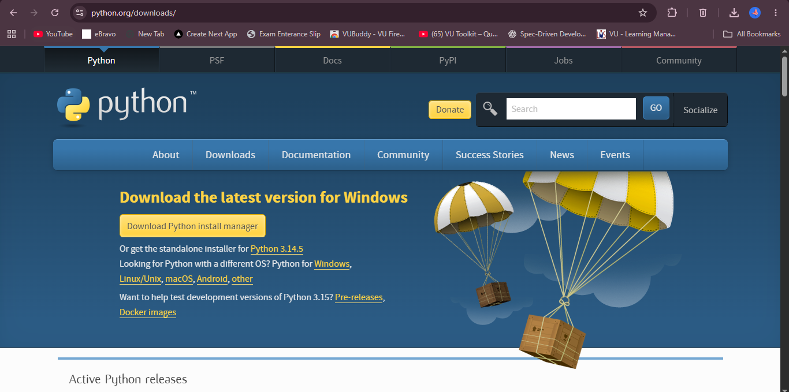
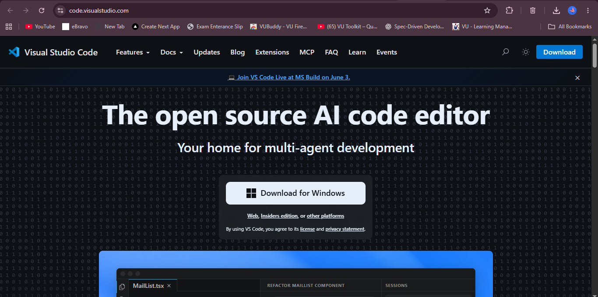
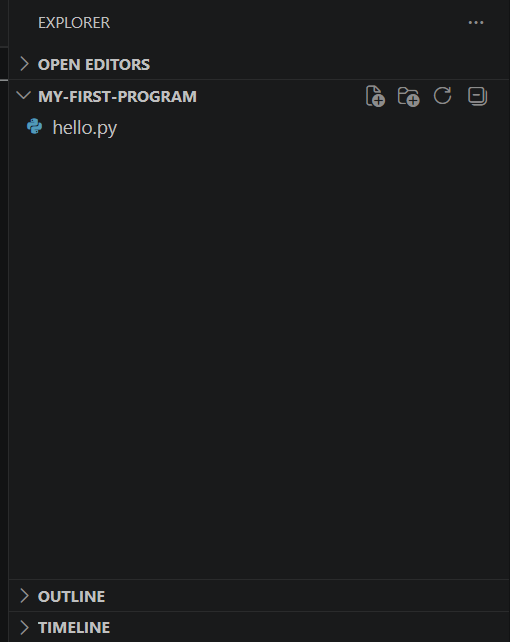
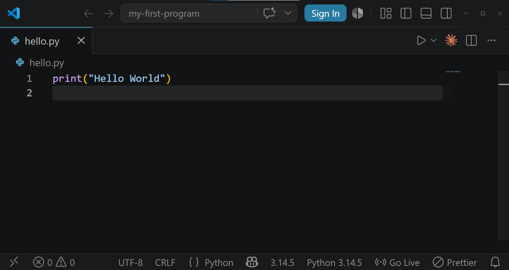

# 📘 Lecture 02: Introduction to Python 

Welcome to the Python Summer Camp Class 02!

In this lecture, we will learn about Python, its history, features, applications, installation process, and how to write our first Python program.

Python is one of the most beginner-friendly and powerful programming languages used around the world.

---

# Introduction to Python Concepts

- What is Python
- History of Python
- Why Learn Python
- Features of Python
- Applications of Python
- Companies Using Python
- Python Installation
- Install Visual Studio Code
- Create First Python File
- Write First Python Program

---

# What is Python?

Python is a high-level programming language.

- Easy to learn and use
- Interpreted and object-oriented
- One of the most popular programming languages
- Used by beginners, students, and professional developers

## Key Points

- Beginner Friendly
- Simple Syntax
- Powerful Language
- Widely Used

---

# History of Python

Python was created by **Guido van Rossum**.

- Development started in 1989
- First released in 1991
- Named after the comedy show *"Monty Python's Flying Circus"*
- Designed to make programming simple and readable

## Creator

- Guido van Rossum

---

# Why Learn Python?

Python is popular because it is easy and powerful.

## Benefits of Learning Python

- Simple and clean syntax
- Easy to understand
- Beginner-friendly language
- Large community support
- Cross-platform compatibility
- High demand in the job market

---

# Features of Python

Python has many powerful features.

## Easy to Learn

- Simple English-like syntax

## Interpreted Language

- No separate compilation required

## Open Source

- Free to use and modify

## Portable

- Runs on Windows, Linux, and macOS

## Extensive Libraries

- Thousands of built-in and third-party libraries

---

# Applications of Python

Python is used in many fields of technology.

## Uses of Python

- Web Development
- Artificial Intelligence (AI)
- Machine Learning
- Data Science
- Automation & Scripting
- Game Development
- Cyber Security
- Desktop Applications

---

# Companies Using Python

Many famous companies use Python.

## Examples

- Google
- Netflix
- Instagram
- Spotify
- Dropbox
- YouTube

---

# Python Installation

Before writing Python code, we need to install Python on our computer.

## 🌐 Website

```text
python.org/downloads
```

## Action

Click **Download Python**



---

# Install Visual Studio Code

VS Code is a code editor used to write and run Python programs.

## 🌐 Website

```text
code.visualstudio.com
```

## Action

Click **Download for Windows**



---

# Create First Python File

To start coding in Python:

- Create a new file in VS Code
- File name can be anything
- Must end with `.py` extension

## Examples

```text
hello.py
main.py
```

`.py` shows it is a Python file.



---

# Write First Program

Write your first Python program in VS Code.

## Example

```python
print("Hello World")
```



---

# How Python Works

```text
Programmer
   ↓
Python Code
   ↓
Interpreter
   ↓
Computer
   ↓
Output
```